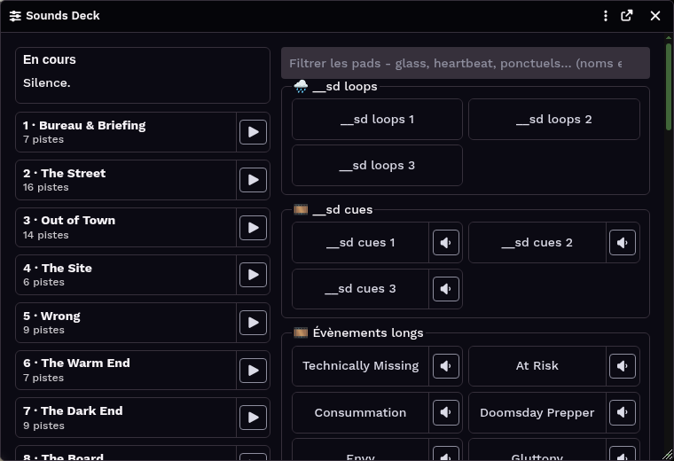

# Sounds Deck

**A deck over Foundry VTT's own playlists.** Music, looping ambience, sound effects and long event cues, played from
one window - with nothing stored anywhere but in the playlists you already have.



- **No second library.** Every sound stays a core `PlaylistSound`. Switch the module off and your playlists are exactly
  as they were, editable in the sidebar as always.
- **Two conventions decide everything**: a playlist's **name** puts it on the deck, its **mode** decides what a press
  does.
- **Built for the gamemaster at the table**: one click to change the music, one click to fire an effect, and the music
  steps aside by itself while an event plays.

**Foundry VTT 14** (verified on 14.368). Gamemaster only.

## Install

In Foundry: **Setup → Add-on Modules → Install Module**, and paste the manifest of the version you want:

```
https://github.com/jkornobis/SoundsDeck-foundryModule/releases/download/v0.6.6/module.json
```

Each release has its own fixed address, so a world changes version only when you install a new one. Enable the module
in your world, then open the deck from the **Sounds Deck** button at the top of the Playlists sidebar.

## Stream Deck

Elgato's own **Hotkey** action is all it takes: no plugin, and nothing to install in Foundry.

### Ready-made profiles

**Stream Deck +** (8 keys, 4 dials):

1. Download [Sounds Deck - Stream Deck +.streamDeckProfile](streamdeck/Sounds%20Deck%20-%20Stream%20Deck%20%2B.streamDeckProfile):
   open the link, then **Download** (or **Raw**) on the file's page.
2. Double-click the downloaded file. The Stream Deck app opens and imports a profile named **Sounds Deck**.
   If nothing happens: Stream Deck app → gear icon → **Profiles** → the menu under the list → **Import**, and pick
   the file.
3. Choose **Sounds Deck** in the profile list at the top of the Stream Deck app.

| Page (swipe the touch strip) | The 8 keys |
|---|---|
| 1 | Beds 1-8 |
| 2 | Moods 1-6, Stop all, Deck (open or close the window) |
| 3 | Tracks 1-8 of the bed that plays |

**The four dials, on every page**: Music, Loops, Events, Effects - turn to move the level, press to mute.

**Stream Deck** (standard, 15 keys): download
[Sounds Deck - Stream Deck.streamDeckProfile](streamdeck/Sounds%20Deck%20-%20Stream%20Deck.streamDeckProfile) and
import it the same way.

| Page | The 15 keys |
|---|---|
| 1 | Beds 1-8, Moods 1-4, Stop all, Deck, **Next page** (bottom right) |
| 2 | Down, up and mute for Music, Loops, Events and Effects, **Previous page** (bottom left) |

The profiles use the shortcuts below; nothing else needs setting up. To build your own layout instead:

- **Keys**: give a key the shortcut of what it should do - Shift+1 for bed 1, Ctrl+Shift+2 for the second mood, Shift+X
  to stop everything.
- **Stream Deck + knobs**: in the Stream Deck app, switch to *Dials*, drag *System → Hotkey* onto a knob, and pick its
  three keys from the key menu, one layer per knob in the deck's order:

  | Knob | Layer | Turn left | Turn right | Press |
  |---|---|---|---|---|
  | 1 | Music | F13 | F14 | F15 |
  | 2 | Loops | F16 | F17 | F18 |
  | 3 | Events | F19 | F20 | F21 |
  | 4 | Effects | F22 | F23 | F24 |

  A notch moves that layer's slider by 5%; a press mutes the layer for everyone and a second press brings it back.
  F13-F24 exist on no keyboard, so nothing else reacts to them. The knob's display can show the label you give it,
  not the live level.

## Set up your playlists

**The name** places a playlist on the deck:

| Name starts with… | On the deck | Example |
|---|---|---|
| a **number and a dot** | a **music** card (one plays at a time) | `1 · Calm`, `2 · Tension`, `3 · Combat` |
| an **emoji** | a **bank of pads** | `💥 Effects`, `🔁 Ambience loops`, `🎬 Events` |
| anything else | not on the deck | `Soundtrack archive` |

**The mode** (Foundry's own playlist setting) decides what a pad in a bank does:

| Mode | A pad is… |
|---|---|
| **Soundboard Only** | a one-shot: click plays it, click again stops it |
| **Simultaneous** | a loop you switch on and off; the others keep playing |
| **Sequential** | an event: it gets pause, stop and a position slider, and the music drops under it |
| **Shuffle** | nothing - the bank is shown greyed |

A music card plays its playlist in whatever order the playlist is set to; **Shuffle** is the natural choice.

**A sound's source** - the film, series or game it comes from - can go in parentheses at the end of its name:
`At Risk (Gone Girl)`. Foundry's playlist sidebar shows the whole name; the deck shows `At Risk`, so the table sees the
moment and not the reference. Only the **last** parentheses are the source: `Ripe (With Decay) (The Fragile)`
shows `Ripe (With Decay)`. The same goes for a sound's *description*. It is a world setting, **Hide sources on the
deck**, on by default; turn it off to see both on the pads. The filter searches the whole name either way.

## What the deck does

- **Now playing**, at the top: everything sounding, each with its volume and a stop; events keep pause and position;
  one button stops it all.
- **Moods.** Save what plays (the music, the room loops and their levels, the random effects) under a name, and bring
  it all back in one click. A recall keeps music that is already playing and never touches an event. Moods belong to
  the world, so every gamemaster seat sees them.
- **Music follows the scene.** A scene that carries a playlist starts its music when it opens, and moving between two
  scenes that share the same playlist **keeps the track playing** (Foundry 14.368 alone restarts it on a new track).
  Music you picked by hand keeps playing into a scene that has none of its own.
- **Ducking.** While an event plays, the music drops about 10 dB and comes back by itself - in every player's browser.
  The small speaker on an event's pad turns this off for that event.
- **For chosen players only.** The 👤 on a pad sends it to the players you tick - a whisper only one agent hears. It
  plays once, and you hear it quietly.
- **Colour, icon, tabs.** In a pad's sound settings, give it a colour and an icon. Each bank has a tab above the
  board: click its name to show that bank alone (again for all), tick others to show them alongside. A search still
  looks in every bank.
- **Combat music.** Choose a *combat mood* with ⚔ on a mood card. When a fight's first round begins, it plays; when the
  fight ends, what played before comes back, the music resuming where it left off. The ⚔ in the Moods header (or
  Shift+F) starts or ends it by hand, and its *Follow the tracker* switch turns the automatic part off.
- **Sounds on game events** (Delta Green). In a bank sound's settings, *Plays on*: a critical success, a critical
  failure, a Sanity loss, or a weapon's damage or Lethality roll - the pad then plays by itself on that roll, for
  everyone, never on a roll the players cannot see. Several pads on one event: a random pick. A weapon can have its own
  pad by name (*Only for weapons named*).
- **Variant pads.** In a one-shot bank, sounds named alike with a number - *Gunshot 1*, *Gunshot 2*, *Gunshot 3* -
  are one pad, *Gunshot ×3*: each press plays one of them, never the same twice in a row.
- **Hidden from players.** Players' playlist sidebar no longer lists the deck's beds and banks while they play, so the
  table cannot read a track's name as it starts; they still hear everything. A module setting, on by default.
- **Pick a track.** The ▸ beside a bed's name lists its tracks, numbered in the playlist's own order; a click plays one.
- **Late joiners hear where the table is.** A player who joins or reloads mid-scene hears the music, loops and events
  where everyone else is, not from the start; and each bed's next track is loaded as soon as the current one starts.
- **See what's coming.** A playing bed names its next track and shows its time; anything you press pulses until it's
  heard.
- **Trim a track.** In a sound's settings, under *Fade*, give a *Start* and an *End* in seconds: it plays only that part,
  and a shuffle moves on at its end.
- **Keyboard shortcuts.** Shift+D opens or closes the deck, Shift+X stops everything, Shift+1…8 plays the bed with that
  number, Ctrl+Shift+1…9 recalls the mood at that place in the list, Ctrl+Alt+1…9 plays that track of the bed that plays,
  Shift+F starts or ends combat music. All can be rebound in *Configure Controls*.
- **Pads on the hotbar.** Drag a pad onto Foundry's macro hotbar: it becomes a button that presses it, and the hotbar's
  own number keys fire it too.
- **A scene brings back a mood.** In a scene's settings, under its playlist, pick a *Mood*: opening the scene recalls it,
  like its card. It takes the place of the scene's playlist.
- **One crossfade between beds.** Switching beds starts the new one first and fades the old one out once the new one
  is heard, over the *Crossfade between beds* setting (4 s by default; 0 cuts straight across).
- **Preview in your ear.** The 🎧 on a pad plays it in your browser only, at the level the table would hear, before
  you play it for everyone. Another pad replaces it, the same one again stops it, and it stops by itself after 20 s.
- **Random triggering.** The 🎲 on a one-shot's pad fires it at random moments (every 10–45 s) until you switch it off.
  Set your own interval per sound with the flag `flags["sounds-deck"].random = { min, max }` (seconds).
- **Where a sound comes from** stays in the playlist sidebar by default (see above); with *Hide sources on the deck*
  off, hovering a pad shows the sound's description.
- **Filter** the pads by typing part of a name; **beside or below** layout, **comfortable or compact** pads, and a
  **"?"** that explains all of this - from the window's menu.
- **Press log** (off by default, per browser, in the module settings): records what you pressed during a session, to
  export afterwards.

Available in English and French.

## Develop

Node 22 or later. Three tools in all: Node's built-in test runner, Biome, and nothing else. No build step: Foundry
loads the ES modules in `src/` as they are.

```bash
npm install        # Biome only, pinned
npm test           # the pure rules, outside Foundry
npm run check      # the definition of done: Biome, every test, the manifest rules
```

Tests that need a running Foundry are **Quench** batches in `test/quench/`, run from Quench's own window once the
module is installed. The deck batch walks a real world and names its playlists and scenes - in any other world it
skips and says why. The `tools/` scripts drive a gamemaster session through Chrome's debugger for the maintainers'
own proofs.

Structure and reasons: [`docs/ARCHITECTURE.md`](docs/ARCHITECTURE.md). Decisions: [`docs/decisions/`](docs/decisions/).
Changes: [`CHANGELOG.md`](CHANGELOG.md).

## Licence

Not chosen yet.
