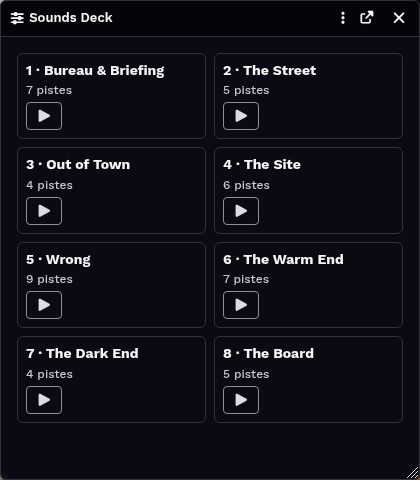

# Sounds Deck

A Foundry VTT module that plays **Foundry's own playlists** as a deck: numbered playlists become **bed cards**,
playlists whose name starts with an emoji become **banks of pads**. There is no second store. Every sound stays a
core `PlaylistSound`, editable in the sidebar with the module switched off.

**Status: 0.1.0 - bed cards.** Proven inside a running world (15 checks); not released, so nothing to install yet.


 The design lives in the Composer's knowledge repository:
`FoundryVTT-KnowledgeDB/worlds/DeltaGreen/knowledge/the-playlist-is-the-bank.md`.

## The two rules

| The playlist's… | decides… | Example |
|---|---|---|
| **name** | whether and where it is on the deck | `5 · Wrong` → a bed card · `🎬 Long events` → a bank · `Références` → not on the deck |
| **core mode** | what pressing one of its sounds does | Soundboard Only → one-shot · Simultaneous → toggle · Sequential → cue with a transport |

## Develop

Node 22 or later. Three tools in all: Node's built-in test runner, Biome, and nothing else. No build step:
Foundry loads the ES modules in `src/` as they are.

```bash
npm install        # Biome only, pinned
npm test           # the pure core, outside Foundry
npm run check      # what must pass before anything is merged: biome ci + tests
npm run format     # rewrite formatting

node tools/live-proof.mjs              # load src/ into the live world's GM session, drive it, measure, clean up
node tools/live-proof.mjs --show x.png # photograph the deck; plays nothing
```

`tools/live-proof.mjs` needs the gamemaster session driven through Chrome's debugger on port 9222 and **refuses
if anyone else is connected or anything is playing** - it starts beds and activates scenes.

Structure and the reasons for it: [`docs/ARCHITECTURE.md`](docs/ARCHITECTURE.md). Decisions:
[`docs/decisions/`](docs/decisions/).

## Licence

Not chosen yet. That is the Composer's call.
